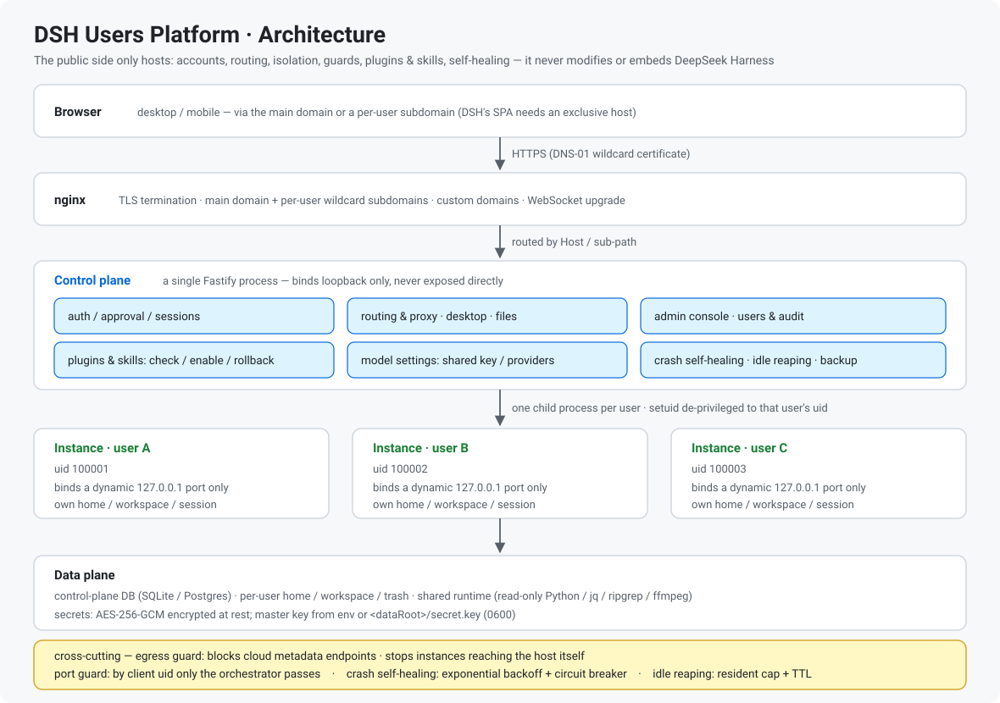
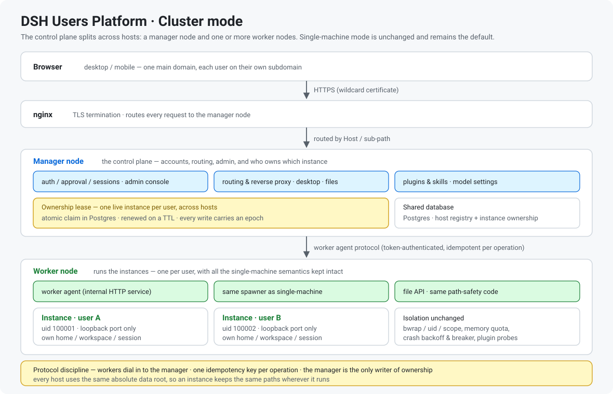

# dsh_ai1net

**DSH AI1NET** · **[中文文档](README.zh-CN.md)**

**Live at [ai1net.com](https://ai1net.com)** — the project's own deployment.

**DSH AI1NET is a capability network** — every machine is a node, every user gets an isolated workspace, and nodes behind NAT reach each other through a self-built relay or a direct path. One command installs it; a browser operates it.

[](https://nodejs.org/)
[](#version-history)
[](https://github.com/deepseek-ai/deepseek-harness)
[](manual/project.md#how-this-project-is-built)
[](manual/project.md)

### Project vision

**Let people co-create capabilities, share them, use them, and amplify them with AI.**

People in the same domain collaborate in a group conversation, with the humans and their agents all in the room: the conclusions they reach, the traps they hit and the practices they settle on accumulate as knowledge under that domain's project, and AI turns that knowledge into reusable capability. Someone joining later does not start from zero.

Sharing used to look different. To hand a finished skill to another person, the file was copied over and each person installed their own. Once on the network, compute and capability are shared online, and nothing has to be copied around.

Each of those needs something first. Co-creation needs a shared place; sharing needs each person to have a place of their own. This project gives every person an isolated workspace behind a kernel boundary, and links those workspaces into one network. Group conversation is the next step along that path, and is not live yet.

### Why this project

DeepSeek Harness installs as a single process with one profile and one data directory, and it has no concept of a second user. Handed to a group, these questions go unanswered: who is allowed in, whose data is whose, who holds the model key, what happens when a process dies, and what a user may install.

A hosted service leaves the data in someone else's hands. Giving everyone a separate install shares nothing and leaves nobody administering anything.

### What it solves

1. **Many users on one deployment** — each gets an isolated workspace behind a kernel boundary, on its own OS account, its own process and its own data root. Desktop and mobile clients can join the same deployment too (the clients are in development).
2. **How the shared model is handed out** — the shared model entry the admin configures is off by default, and its quota is billed to the platform; the admin decides which users it is turned on for. A user can switch it off, not on. Users it is not turned on for never see the shared model in settings. On the same model, a key the user entered takes precedence.
3. **Machines behind NAT reaching each other** — they cannot reach each other on their own, so the network carries its own relay and direct path, and no deployment has to expose a new port.
4. **Crashes and expired sessions** — crash circuit-breaking, repair on demand, and recovery that does not need to be noticed.
5. **How plugins reach a user** — the platform imports **pre-built artifacts only** (a tarball from the official catalogue, or a release asset) and **never runs a third party's build scripts on the platform side**; what the admin picks into the candidate pool (the list of plugins the admin has imported) is the whole of what can be chosen. Users switch on what they need on the **Capability management** page, rather than everything at once.
6. **Users managing their own skills** — shared skills are read-only and available to everyone; the skills a user uploads can be switched on and off, and deleted.

### Where it fits

- A team or a family that wants AI workspaces running on its own hardware.
- Several machines across networks (cloud · home · office) that must reach each other without opening ports.
- Giving a group of people isolated AI workspaces under one administrator.
- Any case where the data must stay in-house rather than with a third party.

**Human planning and key judgment; implementation by AI** (DeepSeek **V4 / V4.1 flash**) — see [how this project is built](manual/project.md#how-this-project-is-built).

## Documentation map

This page keeps only the essentials. Details live in the documents below.

| Document | Contents |
|---|---|
| **[manual/highlights.md](manual/highlights.md)** | The design themes in full (isolation · self-healing · plugin governance · models · testability · operations · overlay network) |
| **[manual/architecture.md](manual/architecture.md)** | The base, request path, self-healing path, **overlay network**, deployment shape, repository layout |
| **[manual/installation.md](manual/installation.md)** | Prerequisites, DNS and certificates, both deployment options, the `nip.io` rehearsal, manual dev setup, **everything about domains** |
| **[manual/configuration.md](manual/configuration.md)** | Every environment variable, defaults and gotchas |
| **[manual/security.md](manual/security.md)** | The security model, surface by surface |
| **[manual/api.md](manual/api.md)** | Control-plane API groups and permissions |
| **[manual/faq.md](manual/faq.md)** | Problems people actually hit |
| **[manual/project.md](manual/project.md)** | How this project is built: who sets the direction, how the AI decides by that method, and how the collaboration runs |
| **[manual/contributing.md](manual/contributing.md)** | Local development, issues and pull requests, version numbers and release history |
| **[PLUGIN-PORTING.md](PLUGIN-PORTING.md)** | Making a plugin work on a multi-tenant platform — failure modes, porting rules, a full case study |
| **[examples/dsh-univer-office/](examples/dsh-univer-office/)** | That case study's porting patch, new modules and companion skill |
| **[install.md](install.md)** | Step-by-step installation instructions written for an AI agent |
| **[COMMERCIAL-LICENSE.md](COMMERCIAL-LICENSE.md)** · **[LICENSE](LICENSE)** | Dual licensing: the AGPL-3.0 open-source track and the commercial track |

Every document has a Chinese counterpart (`*.zh-CN.md`).

## Highlights

The eight themes, one line each:

| # | Theme | In one line |
|---|---|---|
| 1 | **Process-level isolation** | One deterministic uid and one instance per user, with a port guard and an egress guard — isolation on the kernel boundary (uid + bwrap) |
| 2 | **Self-healing** | Crash circuit-breaker, repair-on-demand guardian, and seamless recovery after reaping or session expiry |
| 3 | **Governed plugins & skills** | Pre-checked on import, memory-estimated before enabling, and enabled with probe + snapshot rollback + per-plugin isolation |
| 4 | **Models & access surface** | The platform writes credentials itself (the official model page cannot work here) and reads the instance's own provider catalogue; access by sub-path, subdomain or custom domain |
| 5 | **Testable & regressable** | Every key decision is a pure function, so behaviour can be reasoned about without an instance |
| 6 | **Deploy & operate** | One command, idempotent and rehearsable, with a self-adapting nginx reverse proxy |
| 7 | **Overlay network** | Nodes behind NAT still reach each other: one outbound connection each, a loopback-only relay, an optional direct path, and identity verified where the node is |
| 8 | **Cluster mode** | The control plane splits into a manager node and worker nodes: ownership is settled by an **atomic lease in Postgres**, every write carries an epoch, and the worker keeps the single-machine spawner — so isolation semantics do not change when hosts are added |

👉 **Full detail: [manual/highlights.md](manual/highlights.md)**

## Architecture



Built on [DeepSeek Harness](https://github.com/deepseek-ai/deepseek-harness) (**MIT**) and invoked as a child process.

**Request path**: browser → nginx (TLS) → control plane (auth / approval / admin / web desktop) → routed by `Host` or `/u/<userId>/dsh/*` → the user instance (loopback only).
**Self-healing**: a crash → spawn a guardian once to repair the profile → restart; repeated crashes back off and trip a circuit-breaker.

### Cluster mode



The architecture diagram shows the single-machine deployment, which is the default. Cluster mode splits it across hosts **without changing what a user gets**:

| Piece | Responsibility |
|---|---|
| **Ownership lease** | One live instance per user is settled by an **atomic claim in Postgres** — single-machine mode gets this for free from an in-process map. The lease carries a TTL with periodic renewal, and every write is stamped with an **epoch** so the owner is always unambiguous |
| **Worker agent** | The inbound surface on a worker (token-authenticated), exposing instance lifecycle and file operations. It reuses the single-machine spawner and the same path-safety code, so bwrap/uid/scope isolation, memory quotas, crash backoff and plugin probes behave identically. Workers dial in to the manager and take a whitelisted set of actions with bounded parameters |
| **Shared database** | A worker registry plus instance ownership (`host_id` / `epoch` / `lease_until`) |
| **One baseline** | Every worker uses the same absolute data root, so an instance's paths mean the same thing on any host |

### Overlay network

A node sitting behind NAT with **no inbound port** is still reachable. Each node makes **one outbound connection**; the relay multiplexes every stream over it and, for its part, binds **loopback only** — so adding nodes never adds publicly reachable surface. To the caller the address stays an ordinary host and port, which is why the transport can be replaced without touching the request path.

On top of that channel a **direct path** is attempted: candidate endpoints are exchanged over the connection that already exists (no new port, no new protocol), and a UDP path counts only when it works in **both** directions. Otherwise it is declared dead and the fall back is named — off, cooling down, no address, one-way, or past the deadline. A direct path only affects speed, not whether it works.

**Identity decides before address does.** An offline root authorises signers; online signers issue node credentials; every node holds its own key; sessions use an in-memory key. Whether a node may join is verified **on the node itself** — a compromised control plane cannot silently insert one — and anything unverifiable is refused with a named reason. Addresses come from a signed directory that can be rotated, so moving a relay does not require reinstalling clients.

👉 **Interactive diagram: [diagrams/archify/overlay-architecture.html](diagrams/archify/overlay-architecture.html)**

👉 **Full detail: [manual/architecture.md](manual/architecture.md)**

## Features

> One table per module. Mechanism and trade-offs: see [Highlights](manual/highlights.md).

### Accounts and portal

| Feature | Description |
|---|---|
| Registration and approval | The first administrator is created by the install script (`node lib/cli.js bootstrap-admin` under the hood); new users must be approved before they can log in |
| User management | Approve / disable / delete (cascading cleanup of sessions, instances and directories); grant the shared model per user; admins can jump straight into a user's session |
| Sessions and login | Opaque random tokens (only a SHA-256 hash is stored); one active session plus local idle reaping |
| Web desktop | Browse / create / upload / download files; start a session per folder; double path fencing |

New users land on the registration page — credentials, a human-verification step and an email code:


Returning users sign in from the login page:


### Instances and runtime

| Feature | Description |
|---|---|
| Per-user isolation | A dedicated instance per user: soft → OS-account hard isolation → port guard |
| Crash self-healing | Crash detection → repair via an on-demand guardian instance → automatic restart, with backoff, circuit-breaking and observability |
| Recovery after reaping | Returning to the page wakes it and re-establishes the connection; navigation goes through a transition page, XHR waits for readiness, 401 is replayed transparently |
| Session-expiry self-healing | A self-healing script injected into the instance HTML — no manual refresh |
| Shared runtime | A portable Python 3.12 plus static jq / ripgrep / ffmpeg; version baseline frozen and drift is inspected |
| Egress guard | Blocks cloud metadata endpoints, prevents instances from reaching the host itself, and observes new outbound connections |
| Memory governance | A tunable V8 heap limit per instance, sampling alerts and a breakdown probe |

An instance that was reaped and opened again shows a **self-recovering** transition page instead of an error. The shared runtime lives under `/usr`, which is mounted **read-only** inside an instance — so what is installed is plain to see.

### Plugins and skills

| Feature | Description |
|---|---|
| Candidate pool | Admins import (official-catalogue allowlist / tgz upload); users enable and disable per instance themselves |
| Compatibility pre-check | Dependency range plus exported symbols; incompatible plugins are rejected by default with the evidence shown |
| Safe enable/disable | Probe + snapshot rollback + a per-plugin isolation flag, so an incompatible plugin never drags the instance into a crash loop |
| Memory estimation | Estimated badges and status bars; exceeding the per-instance cap is blocked and requires confirmation |
| Provider coordination | After enable/disable, dsh-web's search provider is recomputed from the current bundles, avoiding multi-provider conflicts |
| Skill management | Shared plus personal skills: upload / list / enable / disable; two-phase zip replacement with symlink-traversal and zip-bomb protection |

### Models and credentials

| Feature | Description |
|---|---|
| Model entries | Built-in DeepSeek + the official provider catalogue + custom OpenAI-compatible gateways; each entry can be enabled / disabled / switched individually |
| Official provider catalogue | Reads the same `pi-ai` package the instance uses (currently 39 providers); picking one only needs an API key |
| How it lands | The platform writes enabled entries into the instance's `.credentials.yaml` and `settings.yaml`, touching only entries it wrote itself |
| Shared model entry | **Granted per user** — an admin turns it on in the user list (off by default), and only then does that user see it in their settings and get to use it |
| Key security | AES-256-GCM encryption at rest; the shared platform environment variables are not injected when the user brings their own key; switching restarts the instance to take effect |

### Access shapes and operations

| Feature | Description |
|---|---|
| Multiple access shapes | Sub-path `/u/<userId>/dsh/` ｜ per-user subdomain `<username>.<main-domain>` (HTTP + WebSocket) ｜ custom domains |
| Storage and cleanup | Per-user storage accounting; session retention, workspace cleanup and trash cleanup |
| Backup | One-click platform backup (a consistent SQLite snapshot plus configuration and artifacts) |
| Audit | Registration / login / approval / key changes / plugin delivery and more are written to `audit_log` |
| Chat | The complete chat interface users ultimately get (conversation + tool calls + plugin skills) |

## Installation

**Requirements**: Linux (Debian/Ubuntu or RHEL family) + systemd + **root**, Node.js **^22.19 or ≥24**, and — for the full feature set — **a domain with a wildcard certificate**.

With a domain (recommended):

```sh
git clone https://github.com/maogeigei/dsh_ai1net.git
cd dsh_ai1net
sudo CF_API_TOKEN=xxx bash install.sh --domain dsh.example.com --email you@example.com
```

Without a domain (verify the wiring only; the chat interface will not open):

```sh
sudo bash install.sh
```

Verify:

```sh
systemctl is-active dsh_ai1net                    # expect: active
curl -I http://dsh.example.com/                   # expect: 200 (or 301 to https)
curl -I https://test.dsh.example.com/             # expect: 401 (not logged in)
```

Then log in to the admin console and approve the first user; that user can then start a session from the web desktop.

> 🤖 **Want an AI agent to install it?** Hand it [install.md](install.md) — step-by-step instructions with a check for every step and explicit "stop here" criteria.

👉 **Full detail: [manual/installation.md](manual/installation.md)** (DNS records, certificate issuance, both options compared, the `nip.io` rehearsal, manual dev setup, and everything about domains) · **Environment variables: [manual/configuration.md](manual/configuration.md)**

## Plugin porting

A hosting platform makes **completely different** assumptions from "running locally": `127.0.0.1` on the server side is the server, while `127.0.0.1` in the browser is **the user's own computer**. Plenty of plugins work fine locally and break completely once hosted — and the platform cannot compensate.

The eight failure modes, one line each:

| Mode | Symptom | Fix |
|---|---|---|
| **Absolute URL handed to the browser** | The UI frame renders but the content stays blank — **blocking** | Make it a same-origin relative path |
| **Internal communication over TCP loopback** | The plugin's own service never starts | Use a unix domain socket or stdio |
| **Creating its own network listener** | Tenants interfere with each other | Reuse the host's single entry point |
| **Client assembles an absolute address** | Same as the first mode | The host must produce relative paths |
| **Version incompatibility with bundled packages** | The instance crash-loops | Align the dependency range and exported symbols |
| **Heavy dependency statically imported** | One plugin eats a sixth of the instance's memory | Lazy-load with `await import()` |
| **The client half hangs silently** | The server side is fine, the browser shows nothing, with no error and no log | Remove from `inject` any UI package not guaranteed in that role |
| **A native binding needing a newer glibc** | The process dies after the work is done, or `GLIBC_2.35 not found` takes it down | Ship the runtime it needs, or move to a newer base image |

👉 **Full guide with the porting rules, the complete case study and a pre-release checklist: [PLUGIN-PORTING.md](PLUGIN-PORTING.md)**
📦 **Worked example: [examples/dsh-univer-office/](examples/dsh-univer-office/)** — the porting patch, new modules and companion skill, with the upstream baseline and how to apply it.

## Version history

### v1.4.1 — 2026-09-19 · fix

- **A cold-starting instance answers `503` instead of a bare socket close** — while an instance is coming up its port is already allocated but nothing is listening yet; the proxy used to drop the connection without writing a response, which the edge could only report as `502`. It now replies `503` with `Retry-After`, and a navigation request gets a small page that retries on its own. Only a response already in flight is torn down.
- **Housekeeping** — the overlay network's operational probes and drills no longer ship: they are written against one specific two-machine deployment, their runbooks live with the operator documentation, and the host identifiers are part of their code rather than their wording.

### v1.4.0 — 2026-09-19 · feature

- **Deployment values live in config files** — the domain, addresses, ports and credentials a deployment needs are read from `config/platform.env` (template: `config/platform.env.example`) or the same-named environment variables. The real file is git-ignored and shipping it is not possible. Precedence: system environment > `config/platform.env` > neutral built-in defaults that are safe to boot with.
- **No real value ships in the code** — the overlay bootstrap seeds, the platform directories and the install root are resolved from configuration, so a copy of this repository carries no address, host or directory belonging to someone else's deployment.
- **One place resolves every deployment path** — `src/platform-paths.ts` is the single source for the data root, the platform state / backup / artifact directories and the install root; nothing recomputes them.

### v1.3.1 — 2026-09-19 · feature

- **Shared model is granted per user** — an admin turns it on for each user in the user list (off by default); only then does that user see the platform shared model in their settings and get to use it.
- **Model landing follows ownership** — the platform writes an instance's credentials and settings through the same ownership-routed file layer as the file surface, so it lands correctly when the instance lives on another host.

### v1.3.0 — 2026-09-19 · feature

- **Overlay network** — a self-built relay plus direct P2P paths, so instances sitting on different networks can reach each other without each of them needing a public endpoint: node identity keys, rendezvous, an endpoint directory with placement, and content distribution (chunking plus a group key) all ship in-tree under `src/net/`.
- **Registration and accounts** — account creation is gated by human verification and an email verification code.
- **Overlay control plane** — the administrator surface carries the node registry, joins and placement for the overlay, alongside the existing cluster controls.
- **Housekeeping** — the published copy no longer ships the regression suite, the smoke scripts or the runtime screenshots; the verification scripts that guard shipping behaviour stay.

### v1.2.0 — 2026-09-15 · feature

- **Cluster mode** — the control plane can now run split across hosts: a manager node plus worker nodes, with per-instance **ownership leases** so a restart on one host does not fight the other, a remote spawner, and a host-agent path for filesystem and instance operations. The single-machine mode is unchanged and remains the default.
- **Multi-language runtime** — the platform UI ships a runtime i18n layer, so the interface language is no longer baked into the pages.
- **Per-instance skill grouping** — the instance-side "my skills" view is grouped rather than a flat list.
- **Fixed** — the deployment-mode parser and its declared type now agree, so the configuration surface is consistent end to end.

### v1.1.0 — 2026-09-14 · feature

- **Model settings** — the model dialog mirrors the official interaction, and the recommended plugin catalogue is filtered by the dsh version actually installed.
- **Instance memory** — the per-instance budget is now a single rule (base 448 MiB → max 1024 MiB) and is decoupled from which plugins are enabled, so toggling a plugin no longer changes the quota it reports.
- **Faster page loads** — the browser no longer re-downloads the whole plugin script bundle (about 11 MB) on every page view: the merged `/plugins/` script table now carries an `ETag` and answers `304`, and the HTML shell is served `no-cache` so a stale shell can no longer leave the page stuck at "Failed to load plugins".
- **Proxy hardening** — stale `dsh-auth` cookies are cleared on rewrite, fixing a `431` that surfaced as "Failed to load plugins".
- **Single-machine deployment** — the platform ships the single-machine backend, and the deployment mode is settled at startup.

### v1.0.0 — 2026-09-13 · first public release

- First public snapshot: one-shot single-machine deployment, per-user process isolation, crash self-healing, and governed plugin and skill management.

## Credits

- **DeepSeek Harness** — [deepseek-ai/deepseek-harness](https://github.com/deepseek-ai/deepseek-harness) (**MIT**). This project neither modifies nor embeds DSH; it invokes the locally installed `dsh` as a child process. **Thanks to the DeepSeek team for open-sourcing it.**
- **`dsh-univer-office`** — [dream-num/dsh-univer-office](https://github.com/dream-num/dsh-univer-office) (**Apache-2.0**), by **[dream-num](https://github.com/dream-num)**. It is the real-world case study behind the plugin porting guide. **Thanks to the author and the Univer community** — being able to move a 41 MB online spreadsheet plugin into a hosted environment at all depends on someone having built it first.
- The porting patch and new modules under [examples/dsh-univer-office/](examples/dsh-univer-office/) are offered under **Apache-2.0** as well, so they stay consistent with upstream and are easy to merge back.

## License

Copyright (C) 2026 maogeigei

This project is **dual-licensed**.

**1 · Open source — GNU Affero General Public License v3.0** (the default). Full text in [LICENSE](LICENSE).

Free to use, modify and distribute, **including commercially**. AGPL's source-disclosure obligation applies: anyone who distributes this software, or offers a modified version to others as a network service, must provide those users with the modified source code (AGPL-3.0 §13).

**2 · Commercial license.** For use **without** those source-disclosure obligations — most commonly running a closed-source hosted service, or embedding this software in a proprietary product — a commercial license is available. Scope and how to obtain it: **[COMMERCIAL-LICENSE.md](COMMERCIAL-LICENSE.md)**.

For a commercial license, write to **maogeigei@gmail.com** for terms and pricing.
