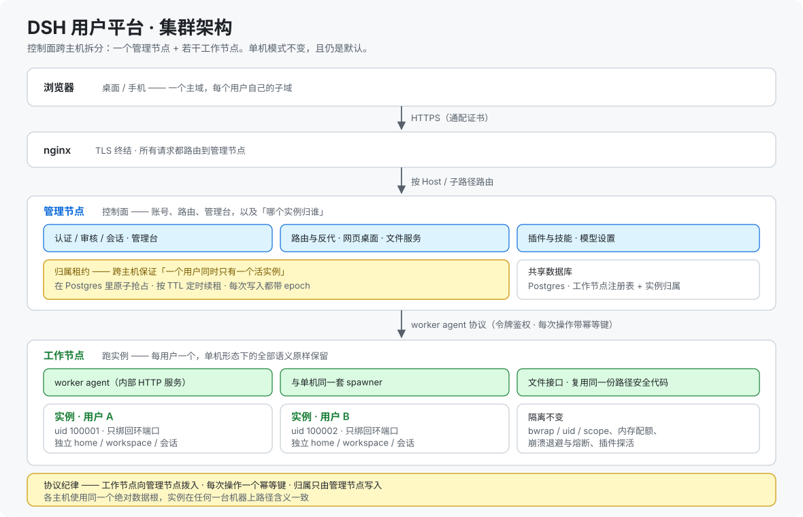
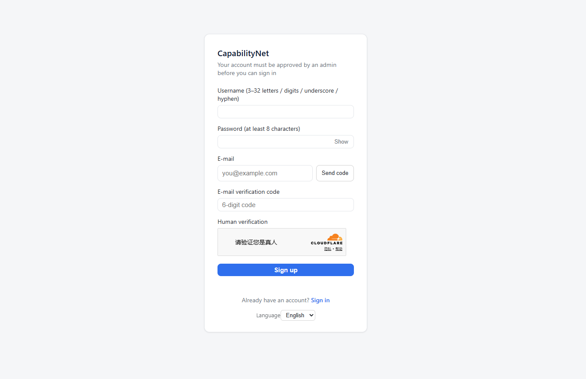
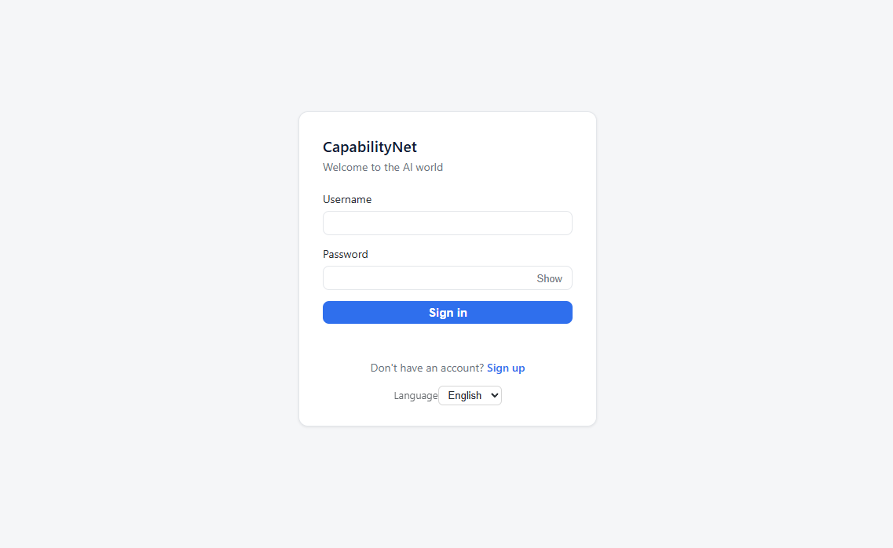

# dsh_ai1net

> **English (primary): [README.md](README.md)** ｜ **[中文文档](README.zh-CN.md)（当前）**

**能力网络** · **DSH AI1NET**

**线上运行于 [ai1net.com](https://ai1net.com)**，也就是本项目自己的部署。

**DSH AI1NET 是一张能力网络**：每台机器是一个节点，每个用户拿到一套隔离工作区，NAT 之后的节点之间经自研中继或直连通路互通。一条命令装好，之后在浏览器里操作。

[](https://nodejs.org/)
[](#版本更新说明)
[](https://github.com/deepseek-ai/deepseek-harness)
[](manual/project.zh-CN.md#项目如何建成)
[](manual/project.zh-CN.md)

### 项目愿景

**让人们在平台上共创能力、分享能力、使用能力，借助 AI 放大能力。**

同一个领域的人在一个群组对话里协作，人和各自的 agent 都在群里：聊出来的结论、踩过的坑、定下的做法，沉淀成这个领域项目下的知识，再由 AI 把这些知识变成可复用的能力。后来的参与者不必从零开始。

能力共享在此之前是另一副样子。技能写好之后要给别人用，只能把文件传过去，各人装各人的。接入网络之后，算力和能力都在线共享，不必传来传去。

两件事各有前提。共创要有一块共同的地方，共享要有各归各的地方：本项目给每个人一套隔离工作区，落在内核边界之内，再把这些工作区连成一张网络。群组对话是这条路上的下一步，尚未上线。

### 为什么做这个项目

DeepSeek Harness 装起来就是一个进程、一个 profile、一个数据目录，不区分第二个用户。交给一群人时，这些事它一件都没答：谁能进、数据归谁、模型密钥在谁手里、进程崩了怎么办、用户能往里装什么。

走托管服务，数据就不在用户手里；让每个人各自装一份，既不共享，也没人管。

### 它解决什么

1. **多人共用一套部署**：每人一套隔离工作区，落在内核边界之内，各有自己的 OS 账号、进程与数据根。桌面版与移动版客户端也能加入同一套部署（客户端在开发中）。
2. **模型的共享方式**：管理员配置的共享模型默认不开，额度记在平台上，由管理员确定给哪位用户开启。用户能关，不能开。未开启的用户，设置页里不出现共享模型条目。同一个模型上，用户填的密钥优先。
3. **内网机器的互通**：NAT 之后的机器互相够不到，网络自带中继与直连通路，任何部署都不必新开公网端口。
4. **进程崩溃与会话过期**：崩溃熔断、按需守护修复、回收与过期后无感恢复。
5. **插件的获取方式**：平台只导入**预构建**产物（官方目录的 tarball 或 release 资产），**不在平台侧跑第三方的构建脚本**；只有管理员挑进候选池（管理员导入的插件清单）的插件，才是可选范围。用户在「能力管理」页里按需开启插件，不必全开。
6. **技能的自主管理**：共享技能所有人只读可用，用户上传的技能可以启停、删掉。

### 适合什么场景

- 团队或家庭想要一套跑在自己硬件上的 AI 工作区。
- 分布在多个网络里的机器（云 · 家 · 办公）需要互通，又不想开端口。
- 给一批人提供互相隔离的 AI 工作区，由一位管理员统一管。
- 数据必须留在本地、不交给第三方的场合。

**基于并验证于 DeepSeek Harness `0.1.5-rc.1`**：[deepseek-ai/deepseek-harness](https://github.com/deepseek-ai/deepseek-harness)（MIT）。

**人负责规划与关键判断，AI 负责实施**（DeepSeek **V4 / V4.1 flash**）。详见[项目如何建成](manual/project.zh-CN.md#项目如何建成)。

## 文档地图

本页只保留核心内容，细节都在下面这些文档里。

| 文档 | 内容 |
|---|---|
| **[manual/highlights.zh-CN.md](manual/highlights.zh-CN.md)** | 设计要点详解（隔离 · 自愈 · 插件治理 · 模型 · 可测 · 运维 · 覆盖网络） |
| **[manual/architecture.zh-CN.md](manual/architecture.zh-CN.md)** | 基座、请求链路、自愈链路、覆盖网络、部署形态、目录结构 |
| **[manual/installation.zh-CN.md](manual/installation.zh-CN.md)** | 前置条件、DNS 与证书、两种部署方式对比、`nip.io` 演练、手动开发部署、关于域名的全部内容 |
| **[manual/configuration.zh-CN.md](manual/configuration.zh-CN.md)** | 全部环境变量、默认值与坑 |
| **[manual/security.zh-CN.md](manual/security.zh-CN.md)** | 安全模型（逐面） |
| **[manual/api.zh-CN.md](manual/api.zh-CN.md)** | 控制面 API 分组与权限 |
| **[manual/faq.zh-CN.md](manual/faq.zh-CN.md)** | 实际会遇到的问题 |
| **[manual/project.zh-CN.md](manual/project.zh-CN.md)** | 项目如何建成：人怎么定方向、AI 怎么照着方法定，以及协作怎么运转 |
| **[manual/contributing.zh-CN.md](manual/contributing.zh-CN.md)** | 本地开发、Issue 与 PR、版本号与发布历史 |
| **[PLUGIN-PORTING.zh-CN.md](PLUGIN-PORTING.zh-CN.md)** | 把插件改造成平台可用：失败模式、改造规范、完整实战 |
| **[examples/dsh-univer-office/](examples/dsh-univer-office/)** | 该实战的改造补丁、新增模块与配套技能 |
| **[install.zh-CN.md](install.zh-CN.md)** | 写给 AI agent 执行的分步安装指令 |
| **[COMMERCIAL-LICENSE.zh-CN.md](COMMERCIAL-LICENSE.zh-CN.md)** · **[LICENSE](LICENSE)** | 双轨授权：AGPL-3.0 开源轨与商业授权轨 |

每份文档都有英文主文档（`*.md`）。

## 亮点

八个主题，每个一句话：

| # | 主题 | 一句话 |
|---|---|---|
| 1 | **进程级安全隔离** | 一人一个确定性 uid、一人一个实例，叠加端口守卫与出网护栏。隔离落在内核边界上（uid + bwrap） |
| 2 | **故障自愈** | 崩溃熔断、按需守护实例修复、被回收与会话过期后无感恢复 |
| 3 | **插件与技能受控管理** | 导入即预检，启用前给出内存预估，启用时走「探活 + 快照回滚 + 逐插件隔离」 |
| 4 | **模型与访问面** | 平台自己写凭据（官方模型页在托管环境必失效），并读实例自带的厂家目录；访问可用子路径 / 子域 / 自定义域名 |
| 5 | **可测与可回归** | 关键决策都是纯函数，不起实例就能推演行为 |
| 6 | **部署与运维** | 一键部署、幂等可预演、反代自适应 |
| 7 | **覆盖网络** | NAT 之后的机器照样互通：每台只拨出一条连接、中继只绑回环、直连可选，而身份在节点本地判定 |
| 8 | **集群模式** | 控制面可拆成「管理节点 + 若干工作节点」：归属由 **Postgres 里的原子租约**裁定，每次写入带 epoch，工作节点沿用单机那套 spawner。**加机器不改变隔离语义** |

👉 **详见 [manual/highlights.zh-CN.md](manual/highlights.zh-CN.md)**

## 架构


基于 [DeepSeek Harness](https://github.com/deepseek-ai/deepseek-harness)（**MIT**），以子进程方式调用。

请求链路：浏览器 → nginx（TLS）→ 控制面（认证 / 审核 / 管理面 / 网页桌面）→ 按 `Host` 或 `/u/<userId>/dsh/*` 路由 → 用户实例（只绑回环）。
自愈链路：崩溃 → 按需拉起守护实例修一次 profile → 自动重启；反复崩溃则退避 + 熔断。

### 集群模式



架构图给的是单机部署，也是默认形态。集群模式把它拆到多台主机上，而用户得到的东西不变：

| 部件 | 负责什么 |
|---|---|
| **归属租约** | 「一个用户同时只有一个活实例」由 **Postgres 里的原子抢占**裁定，单机模式则靠进程内 Map 天然拿到这个保证。租约带 TTL 与定时续租，每次写入都盖 **epoch**，归属始终唯一明确 |
| **worker agent** | 工作节点上的被拨入口（令牌鉴权），暴露实例生命周期与文件操作。它**复用单机那套 spawner 与同一份路径安全代码**，所以 bwrap / uid / scope 隔离、内存配额、崩溃退避与熔断、插件探活的行为完全一致；工作节点向管理节点拨入，只接受白名单动作且参数受限 |
| **共享数据库** | 工作节点注册表 + 实例归属（`host_id` / `epoch` / `lease_until`） |
| **一条基线** | 各工作节点使用**同一个绝对数据根**，实例的路径在任何一台机器上含义一致 |

### 覆盖网络

处在 NAT 之后、**没有任何入站端口**的机器照样可达。每台机器只建**一条出向连接**，中继把所有流多路复用在它上面，而中继自身只绑回环，因此增加节点不会增加公网可达面。对调用方来说，地址仍然是普通的主机与端口，所以换传输不必动请求链路。

在这条通道之上会尝试**直连**：候选端点走已有连接交换（不新增端口、不新增协议），且只有双向都通才算数；否则判死，并**按具名原因**回落：已关闭、冷却中、无地址、单向、超时。直连只影响速度，不影响能不能用。

**先定身份，再定地址。** 离线根授权签名者，签名者签发节点凭据，每台节点各持一把密钥，会话用内存密钥。能不能入网**由节点自己在本地判定**，控制面被攻破也无法静默塞进一台节点；凡不可验证者一律带具名原因拒绝。地址来自一份可轮换的签名目录，所以换中继不需要重装客户端。

👉 **交互图：[diagrams/archify/overlay-architecture.zh-CN.html](diagrams/archify/overlay-architecture.zh-CN.html)**

👉 **详见 [manual/architecture.zh-CN.md](manual/architecture.zh-CN.md)**

## 功能

> 每个模块一张表。机制与取舍见 [亮点](manual/highlights.zh-CN.md)。

### 账号与门户

| 功能 | 说明 |
|---|---|
| 注册与审核 | 首位管理员由安装脚本创建（底层为 `node lib/cli.js bootstrap-admin`）；新用户注册后需审核通过才能登录 |
| 用户管理 | 通过 / 禁用 / 删除（级联清理会话、实例与目录）；按用户授权共享模型；管理员可一键直达用户会话 |
| 会话与登录 | 不透明随机 token（仅 SHA-256 哈希落库）；单活跃会话 + 本地空闲回收 |
| 网页桌面 | 文件浏览 / 新建 / 上传 / 下载；按文件夹启动会话；路径双重围栏 |

新用户从注册页进入，需要账号密码、人机验证与邮箱验证码：



老用户从登录页进入：



### 实例与运行环境

| 功能 | 说明 |
|---|---|
| 每用户隔离 | 每用户独立实例：软隔离 → 账号级硬隔离 → 端口守卫 |
| 崩溃自愈 | 崩溃检测 → 按需守护实例修复 → 自动重启；含退避、熔断与观测 |
| 回收后自愈 | 回页面自动唤醒重建连接；导航走过渡页、XHR 等就绪再转发、401 透明重放 |
| 会话过期自愈 | 实例 HTML 注入自愈脚本，无需手动刷新 |
| 共享运行时 | 可移植 Python 3.12 与 jq / ripgrep / ffmpeg 静态工具；版本基线冻结 + 漂移巡检 |
| 出网护栏 | 屏蔽云元数据端点、阻断实例主动访问宿主自身、观测新建外联 |
| 内存治理 | 每实例 V8 堆限可调 + 采样告警 + 分解探针 |

实例被回收后再打开，看到的是一个**会自动恢复**的过渡页，而不是报错。共享运行时位于 `/usr`，在实例内以**只读**挂载，装了什么一目了然。

### 插件与技能

| 功能 | 说明 |
|---|---|
| 候选池 | 管理员导入（官方目录白名单 / 上传 tgz）；用户在实例内自助启停 |
| 兼容性预检 | 依赖范围 + 导出符号双判据；不兼容默认拒投并回显依据 |
| 启停安全 | 探活 + 快照回滚 + 逐插件隔离标记，不兼容插件不会把实例拖进崩溃循环 |
| 内存预估 | 预估徽章与状态条；超单实例上限时拦截并要求确认 |
| provider 联动 | 启停后按当前 bundles 重算 dsh-web 的 search provider，避免多 provider 冲突 |
| 技能管理 | 共享技能 + 个人技能上传 / 列表 / 启停；zip 两阶段替换，含 symlink 穿透与 zip bomb 防护 |

### 模型与凭据

| 功能 | 说明 |
|---|---|
| 模型条目 | 内置 DeepSeek + 官方厂家目录 + 自定义 OpenAI 兼容网关；每条可单独启用 / 停用 / 切换 |
| 官方厂家目录 | 读实例所用的同一个 `pi-ai` 包（当前 39 个厂家），选中只需填 API Key |
| 落地方式 | 平台把「已启用」条目写进实例的 `.credentials.yaml` 与 `settings.yaml`，只动平台自己写过的条目 |
| 共享模型条目 | 按用户授权：管理员在用户列表里逐个开启（默认关闭），开启后该用户才能在设置里看到并使用 |
| 密钥安全 | AES-256-GCM 静态加密；用户自配时不注入平台共享的环境变量；切换后实例自动重启生效 |

### 访问形态与运维

| 功能 | 说明 |
|---|---|
| 多形态访问 | 子路径 `/u/<userId>/dsh/` ｜ 每用户子域 `<用户名>.<主域>`（HTTP + WebSocket）｜ 自定义域名 |
| 存储与清理 | 每用户存储用量上报；会话保留期回收 / 工作区清理 / 回收站清理三件套 |
| 备份 | 平台一键备份（SQLite 一致性快照 + 配置 + 产物） |
| 审计 | 注册 / 登录 / 审核 / 改密钥 / 插件投放等写入 `audit_log` |
| 对话界面 | 用户最终拿到的完整对话界面（对话 + 工具调用 + 插件技能） |

## 安装

**要求**：Linux（Debian/Ubuntu 或 RHEL 系）+ systemd + root、Node.js ^22.19 或 ≥24；要完整能力还需要**一个域名 + 通配证书**。

有域名（推荐）：

```sh
git clone https://github.com/maogeigei/dsh_ai1net.git
cd dsh_ai1net
sudo CF_API_TOKEN=xxx bash install.sh --domain dsh.example.com --email you@example.com
```

无域名（只验证链路可用；聊天界面打不开）：

```sh
sudo bash install.sh
```

验证：

```sh
systemctl is-active dsh_ai1net                    # 期望 active
curl -I http://dsh.example.com/                   # 期望 200（或 301 跳 https）
curl -I https://test.dsh.example.com/             # 期望 401（未登录）
```

之后登录管理台、审核第一个用户；该用户即可在网页桌面里启动会话。

> 🤖 **想让 AI agent 自己装？** 把 [install.zh-CN.md](install.zh-CN.md) 交给它，那是一份分步指令，含每步校验与「不满足就停手」的判据。

👉 **详见 [manual/installation.zh-CN.md](manual/installation.zh-CN.md)**（DNS 记录、证书签发、两种方式对比、`nip.io` 演练、手动开发部署、关于域名的全部内容）· **环境变量见 [manual/configuration.zh-CN.md](manual/configuration.zh-CN.md)**

## 插件改造

托管平台和「本地跑」的假设完全不同：服务端的 `127.0.0.1` 是服务器，浏览器里的 `127.0.0.1` 是**用户自己的电脑**。很多插件在本地正常，一放上平台就失效，而平台侧无法补救。

八个失败模式，每个一句话：

| 模式 | 症状 | 改法 |
|---|---|---|
| **绝对 URL 交给浏览器** | 页面框架渲染了但内容永远白屏，阻断级 | 改成同域相对路径 |
| **内部通信走 TCP loopback** | 插件自带服务起不来 | 改 unix domain socket 或 stdio |
| **自建网络监听** | 多租户互相干扰 | 复用 Host 的唯一入口 |
| **浏览器地址由客户端拼** | 同第一条 | 地址必须由 Host 生成且为相对路径 |
| **与平台内置包版本不兼容** | 实例崩溃循环 | 对齐依赖范围与导出符号 |
| **重型依赖在入口静态 import** | 一个插件吃掉实例六分之一内存 | 改 `await import()` 懒加载 |
| **客户端半边静默挂死** | 服务端一切正常，浏览器里什么都没有，无报错、无日志 | 从 `inject` 里移除目标角色不必然存在的 UI 包 |
| **原生绑定要求更新的 glibc** | 活干完之后进程才死，或 `GLIBC_2.35 not found` 把进程带崩 | 自带所需运行时，或换更新的基底镜像 |

👉 **含改造规范、完整实战与上架前自查清单：[PLUGIN-PORTING.zh-CN.md](PLUGIN-PORTING.zh-CN.md)**
📦 **改造示例：[examples/dsh-univer-office/](examples/dsh-univer-office/)**：改造补丁 + 新增模块 + 配套技能，附上游基线与应用方法。

## 版本更新说明

### v1.4.1 —— 2026-09-19 · 修复

- **冷启动中的实例回 `503`，不再裸断连接**：实例刚拉起时端口已分配但还没开始监听；此前转发失败会直接断开且不写任何响应，边缘只能报 `502`。现在回 `503` 并带 `Retry-After`，导航请求还会得到一页会自行重试的提示页；只有响应已开始发出的情况才断开。
- **整理**：覆盖网络的运维探针与演练脚本不再随仓库分发。它们是针对某一个特定双机部署写的，使用流程在运维文档里，且主机标识是代码的一部分而非措辞。

### v1.4.0 —— 2026-09-19 · 特性

- **部署值改由配置文件提供**：部署所需的域名、地址、端口与凭据从 `config/platform.env`（模板 `config/platform.env.example`）或同名环境变量读取；真实文件已被 git 忽略，也不会随仓库分发。优先级：系统环境变量 > `config/platform.env` > 可安全启动的中性默认值。
- **代码内不再含任何真实部署值**：覆盖网络引导种子、平台目录与安装根一律从配置解析，因此本仓库的副本不携带他人的任何地址、主机或目录。
- **部署路径只有一处解析**：`src/platform-paths.ts` 是数据根、平台 state / backups / artifacts 目录与安装根的唯一来源，别处不再重算。

### v1.3.1 —— 2026-09-19 · 特性

- **共享模型改为按用户授权**：管理员在用户列表里逐个开启（默认关闭）；开启后该用户才能在设置里看到平台共享模型并使用。
- **模型落地跟随归属**：平台写实例的凭据与设置时，走的是与文件面同一套「按归属路由」的文件层，因此实例在另一台主机上也能正确落地。

### v1.3.0 —— 2026-09-19 · 特性

- **覆盖网络**：自研中继 + 直连 P2P 通路，处在不同网络里的实例无需各自拥有公网入口即可互通。节点身份密钥、会合、带选点的端点目录，以及内容分发（分块 + 组密钥）全部随仓发布，位于 `src/net/`。
- **注册与账号**：账号创建增加人机验证与邮箱验证码两道关卡。
- **覆盖网络控制面**：管理台在既有集群控制之外，承载覆盖网络的节点注册、入网与选点。
- **整理**：公开发布不再附带回归测试、冒烟脚本与运行展示截图；守护交付行为的校验脚本保留。

### v1.2.0 —— 2026-09-15 · 特性

- **集群模式**：控制面可以跨主机拆分运行，一个管理节点 + 若干工作节点，带**实例归属租约**（避免两台机器上的重启互相抢）、远程 spawner，以及用于文件与实例操作的 host-agent 通道。单机模式不变，仍是默认。
- **多语言运行时**：平台界面增加运行时 i18n 层，界面语言不再写死在页面里。
- **实例内「我的技能」分组**：由平铺列表改为分组展示。
- **修复**：部署模式解析器与类型声明现已一致，配置面从头到尾自洽。

### v1.1.0 —— 2026-09-14 · 特性

- **模型设置**：模型设置页复刻官方交互；官方推荐插件目录按实际安装的 dsh 版本过滤。
- **实例内存**：配额口径统一为一条规则（基础 448 MiB → 上限 1024 MiB），并与插件启用状态解耦，开关插件不再改变它报告的配额。
- **页面加载提速**：浏览器不再每次重下整包插件脚本（约 11 MB）。合并后的 `/plugins/` 脚本表现在带 `ETag`、命中即返回 `304`；HTML 外壳下发 `no-cache`，陈旧外壳不再把页面卡在「Failed to load plugins」。
- **代理加固**：回写时清理陈旧的 `dsh-auth` cookie，修掉表现为「Failed to load plugins」的 `431`。
- **单机部署**：平台发布的是单机后端，部署模式在启动阶段即已确定。

### v1.0.0 —— 2026-09-13 · 首个公开发布

- 首个公开快照：单机一键部署、每用户进程级隔离、崩溃自愈、插件与技能的受控管理。

## 致谢

- **DeepSeek Harness**：[deepseek-ai/deepseek-harness](https://github.com/deepseek-ai/deepseek-harness)（**MIT**）。本项目不修改、不内嵌 DSH，只以子进程调用本机安装的 `dsh`。**感谢 DeepSeek 团队开源。**
- **`dsh-univer-office`**：[dream-num/dsh-univer-office](https://github.com/dream-num/dsh-univer-office)（**Apache-2.0**），作者 **[dream-num](https://github.com/dream-num)**。它是插件移植指南背后的真实案例。**感谢作者与 Univer 社区**：能把一个 41 MB 的在线表格插件搬进托管环境，前提是有人先把它写出来。
- [examples/dsh-univer-office/](examples/dsh-univer-office/) 下的改造补丁与新增模块同样以 **Apache-2.0** 提供，以便与上游保持一致、方便合并回去。

## 授权

Copyright (C) 2026 maogeigei

本项目采用**双轨授权**。

**一 · 开源轨：GNU Affero General Public License v3.0**（默认）。全文见 [LICENSE](LICENSE)。

可自由使用、修改、分发，**包括商业用途**。AGPL 的源码开放义务适用：任何人分发本软件，或修改后以网络服务的形式提供给别人使用，都需向这些使用者提供修改后的源码（AGPL-3.0 §13）。

**二 · 商业轨。** 若用户希望**不受**上面的开源义务约束（典型场景是运营闭源的托管服务，或把本软件嵌入专有产品），可购买商业授权。适用场景与取得方式见 **[COMMERCIAL-LICENSE.zh-CN.md](COMMERCIAL-LICENSE.zh-CN.md)**。

商业授权请邮件 **maogeigei@gmail.com** 洽谈条款与报价。
