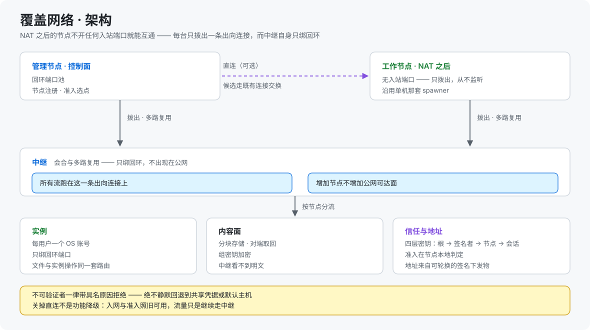

> **English (primary): [architecture.md](architecture.md)** ｜ **[中文文档](architecture.zh-CN.md)（当前）**

[← 回到 README](../README.zh-CN.md)

# 架构详解

图见 [README → 架构](../README.zh-CN.md#架构)。

## 基座

**基座是 [DeepSeek Harness](https://github.com/deepseek-ai/deepseek-harness)（`dsh`）** —— DeepSeek AI 开源的 **agent harness**（MIT，**everything-is-a-plugin** 架构、由 Cordis 驱动）。官方仓库是 <https://github.com/deepseek-ai/deepseek-harness>（npm 包 `@deepseek-ai/dsh` 自己声明的 `repository` 与 `homepage` 都是它），CLI 在其 `apps/cli` 目录下。

| 项 | 值 |
|---|---|
| **本平台基于并验证于的 dsh 版本** | **`0.1.5-rc.1`** |
| 官方仓库 | <https://github.com/deepseek-ai/deepseek-harness> |
| npm 包 | `@deepseek-ai/dsh` |

> ⚠️ **版本是怎么钉的**：`install.sh` 装的是 **latest**、**不钉版本**，所以实际用哪个版本取决于宿主机装了什么。由于 DSH 处于 developer preview 且会有破坏性变更，平台把 DSH 版本当作**冻结的运行时基线**，并在其上做了**插件兼容性预检**与**漂移巡检** —— 宿主换到别的版本时会**看得见**，而不是静默坏掉。

它装起来就是一个进程、一个 profile：`npx @deepseek-ai/dsh web` 在 `127.0.0.1:3080` 起一个 Web UI，插件与技能都挂在同一个 profile 下。里面没有第二个用户这个概念。

本项目**不修改、不内嵌** DSH 的代码，而是在外面套一层托管平台：以子进程按用户各自拉起一个 `dsh` 实例，公网侧负责账号与审核、路由与反代、隔离与护栏、插件与技能的统一管理、崩溃自愈与运维。

> DSH 处于 **developer preview**，官方明说会有**破坏性变更** —— 平台因此把**插件兼容性预检**与**运行时版本冻结**做成了内建能力。

## 官方文档里哪些内容在平台上不适用

DSH 官方文档写的就是这种形态的安装：读者本人就是运维者，浏览器就在同一台机器上。下面逐条点名：托管之后**哪些官方说法不再成立**，以及平台各自用什么替代。

来源：[DeepSeek Harness README](https://github.com/deepseek-ai/deepseek-harness)（`master` 分支）与其文档站 <https://deepseek-harness.github.io/deepseek-harness/>。
**不是官方原句、而是我们真机实测出来的**，一律标注 **[实测]**。

### 1.「从 npm 运行」—— 假定浏览器就在本机

官方原文（README → *Run*）：

> `npx @deepseek-ai/dsh web` … *"The command starts the Web UI at `http://127.0.0.1:3080` by default and opens it in the default browser for a local launch. An SSH launch only prints the host URL because the SSH client or editor owns the local forwarded address."*

**为什么不成立**：这两句都假定**浏览器与进程在同一台机器**上（或者你手里有一条 SSH 端口转发）。平台上浏览器是**用户自己的电脑**，预期访问路径是公网域名 —— 于是 `127.0.0.1:3080` 指向的是**用户自己的笔记本**，`--open` / `--no-open` 也失去意义。

**平台的替代**：`install.sh` 把 DSH 装成**服务**，没有开浏览器的步骤，也不指望终端用户碰 `127.0.0.1`；用户经 nginx 访问 `https://<主域>/`（控制面）与 `https://<用户名>.<主域>/`（自己的 DSH）。见 [installation.zh-CN.md](installation.zh-CN.md)。

### 2. 官方「设置 → 模型」页读不到厂家目录 **[实测]**

该页要求 **Host settings 镜像**，并用 `isLoopback` 一类判定决定持久化。平台是「浏览器 → 域名 → 远程服务器」，这些判定全部不成立、持久化降级为内存 ⇒ **该页根本列不出厂家**。

**平台的替代**：**平台自己写凭据文件** —— 把凭据库里「已启用」的条目直接落到实例的 `$DSH_HOME/.credentials.yaml` 与 `settings.yaml`，且只动带平台 `managed` 标记的条目；厂家清单读的是**实例所用的同一个 `pi-ai` 包**，因此不会漂。见 [highlights.zh-CN.md §四](highlights.zh-CN.md#四模型与访问面)。

### 3. 客户端插件的 `inject` 与官方 UI 包 **[实测]**

官方插件机制允许客户端插件声明 `dsh.client.inject`。平台的**角色补丁按角色禁用若干官方 UI 包** —— 因此插件只注入它在目标角色中确实会被下发的包。

**平台的替代**：见 [PLUGIN-PORTING.zh-CN.md §H7](../PLUGIN-PORTING.zh-CN.md) —— 插件作者**不得** inject 官方 UI 包，除非确认该包在目标角色里必然下发。

### 4.「给插件仓库加 `dsh-plugin` topic 以便被发现」

那是官方的发现路径（GitHub [`dsh-plugin` topic](https://github.com/topics/dsh-plugin)）。插件**不是这样**进到本平台的：平台有**自己的管理员候选池** —— 官方推荐目录、兼容性预检、逐插件内存预估。

### 5.「THERE WILL BE COMPATIBILITY-BREAKING CHANGES」与 `SAFETY.md`

官方明确说 DSH 处于 developer preview 且会有破坏性变更，并把安全提示指向 `SAFETY.md`；但那份提示是写给上面这种安装形态的，因此**不提供任何租户间隔离**。

**平台的替代**：把 DSH 版本当作**冻结的运行时基线**（见上文[基座](#基座)），插件启用前先过兼容性预检，并在其上叠加 uid 隔离、端口守卫与出网护栏。

⇒ 一句话：**官方文档仍是 DSH 本身的权威；本仓库写的是它的托管形态。** 两者不一致的地方，就是这一节。

## 请求链路

浏览器 → nginx（TLS 终结，主域 + 通配子域）→ 控制面（Fastify 单进程：认证 / 审核 / 管理面 / 网页桌面）→ 按 `Host` 或 `/u/<userId>/dsh/*` 路由 → 用户实例（只绑回环动态端口，不出公网）。

## 自愈链路

```
主实例崩溃 ──▶ 按需拉起「守护实例」修复 profile ──▶ 自动重启主实例
     │                                              │
     └── 重复崩溃 ──▶ 指数退避 ──▶ 熔断冷却（10min 起，封顶 6h）──▶ 冷却期内拒绝启动（503）
```

## 覆盖网络



NAT 之后、**没有任何入站端口**的机器照样可达：每台机器只建**一条出向连接**，中继把所有流多路复用在它上面，而中继自身**只绑回环** —— 因此增加节点不会增加公网可达面。对调用方来说，地址仍然是普通的主机与端口，所以换传输不必动请求链路。

在这条通道之上会尝试**直连**：候选端点经**既有连接交换**，因此不新增端口、不新增协议；只有**双向都通**才算数，否则按具名原因回落。关掉直连不是功能降级 —— 入网与准入照旧可用，流量继续走中继。

**身份先于地址**：能不能入网由节点**在本地**判定，所以控制面被攻破也无法静默塞进一台节点；连哪里由一份**可轮换的签名下发物**决定，而不是编译进代码。凡不可验证者一律**带具名原因拒绝**，绝不静默回退到共享凭据或默认主机。

代码在 `src/net/`。设计要点见 [highlights.zh-CN.md §七](highlights.zh-CN.md#七覆盖网络)；可缩放的交互图：[overlay-architecture.zh-CN.html](../diagrams/archify/overlay-architecture.zh-CN.html)。

## 部署形态

单机（裸机 + systemd + nginx）：`sudo bash install.sh` 一键部署；控制面以 `child_process` + `setuid` 编排每用户实例，数据落在本机 SQLite，实例只绑回环端口。

## 目录结构

```
src/            控制面源码（TypeScript）
  db/           数据层（SQLite）
  fs/           每用户文件系统（本机实现 + 路径围栏）
  supervisor/   实例编排（spawn / 代理 / 崩溃策略 / 会话档位）
  web/          Fastify 服务与路由（auth / admin / dsh / skills / plugins / whitelist …）
web/            控制面静态页面（登录 / 注册 / 管理门户 / 唤醒页）
scripts/        运维脚本（安装共享运行时、清理、备份、静态校验）
config/         部署配置（模板 + shell / Node 加载器）
install.sh      单机一键部署
Dockerfile      控制面镜像
README.md       项目说明（主文档）
PLUGIN-PORTING.md  插件移植指南
manual/         配套文档（安装 / 配置 / 安全 / FAQ …）
examples/       插件改造示例
diagrams/       架构图（SVG + 自包含 HTML）
```
